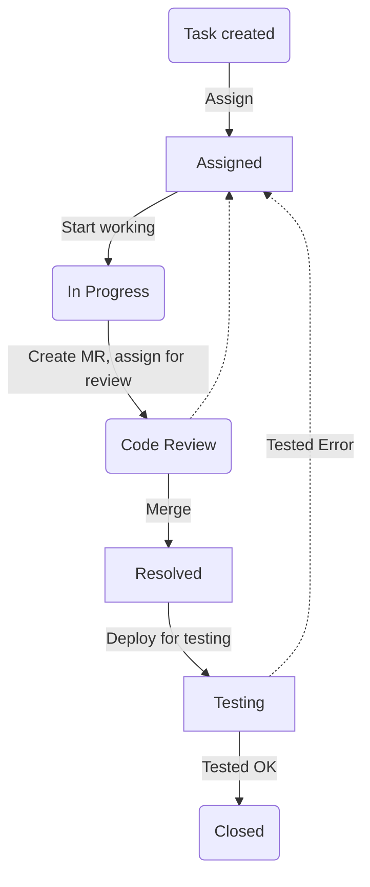
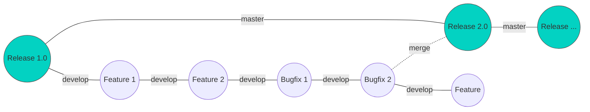
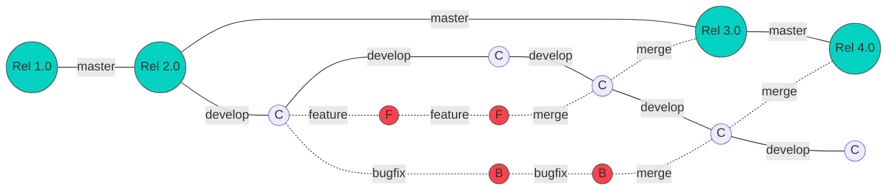

[[_TOC_]]

## 2 Working with tasks

Task status/label flow:



### 2.1 Labels (Tags) meanings

* ~"In Progress" Assignee is working on this task. Task implementation is in progress.
* ~Feedback Need additional information. Add assignee whom you want to ask and reference them with "@" in question comment.
* ~Resolved task is implemented. May be ready for ~Testing once deployed. Or ~"Code Review" once MR is created
* ~Testing task is done and task is deployed to test environment or test product build is available to tester for testing
* ~"Tested OK" Tester confirms that implementation is correct
* ~"Tested Error" Test result invalid
* ~"Code Review" MR is created and assigned to reviewer
* ~"Unit Tests" This task need Unit tests to be implemented. Remove tag once unit tests are implemented
* ~"Design Needed" Task is missing visual or specification design


### 2.2 Where are my tasks?

* **Check your email.** You will be added as Assignee for tasks that are for you to work on. Email notification is automatically sent to you. This means that you should start working on assigned tasks.
* If you are not the only one assignee please consult with manager or add comment to the task if you should be working on it.
* To see tickets that are assigned to you, open [Issues list](https://gitlab.com/hitask/hitask-web/issues) and in search bar use `assignee:` to filter issues by Assignee.
* Work on tasks in order of version and severity. Lower version tasks to be done first. Bug fixes and tasks marked with `Urgent`, `High` labels to be done first.

For example, You have tasks assigned to you:

* Task A, version 1.1
* Task B, version 1.1 `Bug`
* Task C, version 1.2
* Task D, version 1.2 `Urgent`

Your work order will be: B,A,D,C

### 2.3 Working on a task

* When you start working on a task, add Label ~"In Progress" to the task. This way we can see what are you working on.
* If you switch between tasks, remove ~"In Progress" from task you're not working anymore.

#### 2.3.1 Finishing work and handing over

* When work is finished, create a merge request (MR) from `feature/` or `bugfix/` branch with the ticket.
* Check that build pipeline passes before handing over or merging your work to develop branch.
* Remove label ~"In Progress"
* If Code review is required, add label ~"Code Review"
* Assign MR to reviewer
* If there's no Code Review but MR is not merged or not deployed, add label ~Resolved
* If your branch was merged to `develop` and available for qa testing, set label to ~Testing

#### 2.3.2 Task discussions, questions

* If you have question about a task, add assignee person for whom the question is. Or `@mention` them in comment.
* Add label ~"Feedback". Remove ~"In Progress" if you're waiting for input.
* :right\_anger\_bubble: :point\_right: When you ask feedback/questions in tasks, use ”**Start Discussion**” instead of plain comment.


## 5 Git and repository guidelines

### 5.1   Set your git user name and email

Git id should be your Full Name and email. No nicknames please.

<pre>
git config --global user.email "your_email@example.com"
git config --global user.name "Billy Everyteen"
</pre>

* We use western name format, with First name first and Last name second.
* Add avatar picture to your account in Gitlab and Slack. We like to put a face to the name 😎.


### 5.2 Git-Flow

We use [Git-flow system](https://www.atlassian.com/git/tutorials/comparing-workflows/gitflow-workflow)

Main working branch is `develop` from which all work branches are created.  





### 5.3 Branches


* **Current Version** working branch is `develop` This branch is automatically deployed to app.testask.com environment.
* **Next Release Version** branch is called `next`

New features and fixes developed on their own branches, merging them to `develop` (or `next`) afterwards. Bugfixes go under `bugfix/` path, tasks under `feature/` path.

* feature/{task number}
* bugfix/{task number}

Example:

<pre>
feature/3345
bugfix/2901
</pre>

### 5.4 Commit and Merge Request title

1. Commit should provide description of the change 
1. Commit title can be copied form task title.
1. Commit is always related to the task and must contain task number in format `#<number>`

We use Conventional commit format: https://conventionalcommits.org/ (angular standard reference: https://github.com/angular/angular.js/blob/master/DEVELOPERS.md#-git-commit-guidelines)  

This format is required for automated Changelog and release notes generation.

Commit message format: 

```
<type>(<scope>): <subject> #<issue number>
```

* **type** is one of following: `fix`, `feat` (feature), `perf` (performance improvements)
* **scope** (optional field) is module scope of the project: e.g. `time tracking`, `item` (for item edit, view), `item list`, `ui` for general cosmetic/ui changes, `core` for internal changes, `model` for data model/internal database, `all items`/`today`/`calendar` for logical screens of the app.
* **subject** describes the changes on application behavior level. subject mustn't have a form of "changes in someFunction()" - it's obvious from commit diff 
* **issue number** (optional field) is a number if issue related to changes

To set a git commit title template run: 

```
git config commit.template .gitmessage.txt
```

Examples of commit messages:

<pre>
fix(email): Added check for invalid email (#3451)
fix: Time tracking feature added #901
feat(ui): New icons for actions #322
fix(item): Edit Item screen – after attaching image and canceling editing, confirmation alert dialog is shown #6571
perf: Refactoring of ItemDetails screen #6561
</pre>

### Excluding commits from Changelog

Commits that do not follow the template `<type>(<scope>): <subject> #<issue number>` will be excluded from project's Changelog and release notes

Some commits should be excluded, such as:

* Version increase
* Updating project's README or documentation
* Updating Changelog
* Updating project's CI configuration, deployment metadata, screenshots
* Changes in development environment - build configuration changes, tests
* Minor refactoring

Commits that update project dependencies are code-level changes and should be included in Changelog

#### Correct commit message example:

* `Update README`
* `Version update`
* `Bump version to 2.3.2`
* `Add changelog for version 2.3.3`
* `Add screenshots for App Store`
* `Update gitlab-ci configuration`

#### Incorrect commit message examples:

* `refactor: Update README` (unnecessary prefix)
* `feature: version update to 2.2.0` (unnecessary prefix)
* `Refactoring storage module #123`  (missing "refactor:" prefix)
* `Update project dependencies versions` (breaking, testable change: missing feature: prefix)


### 5.6 Merge Requests

**Title with task number**

Usually merge request has same name as the task it's for. Therefore merge request title will be same as task/commits it represents.


**Assign merge request** to reviewer.